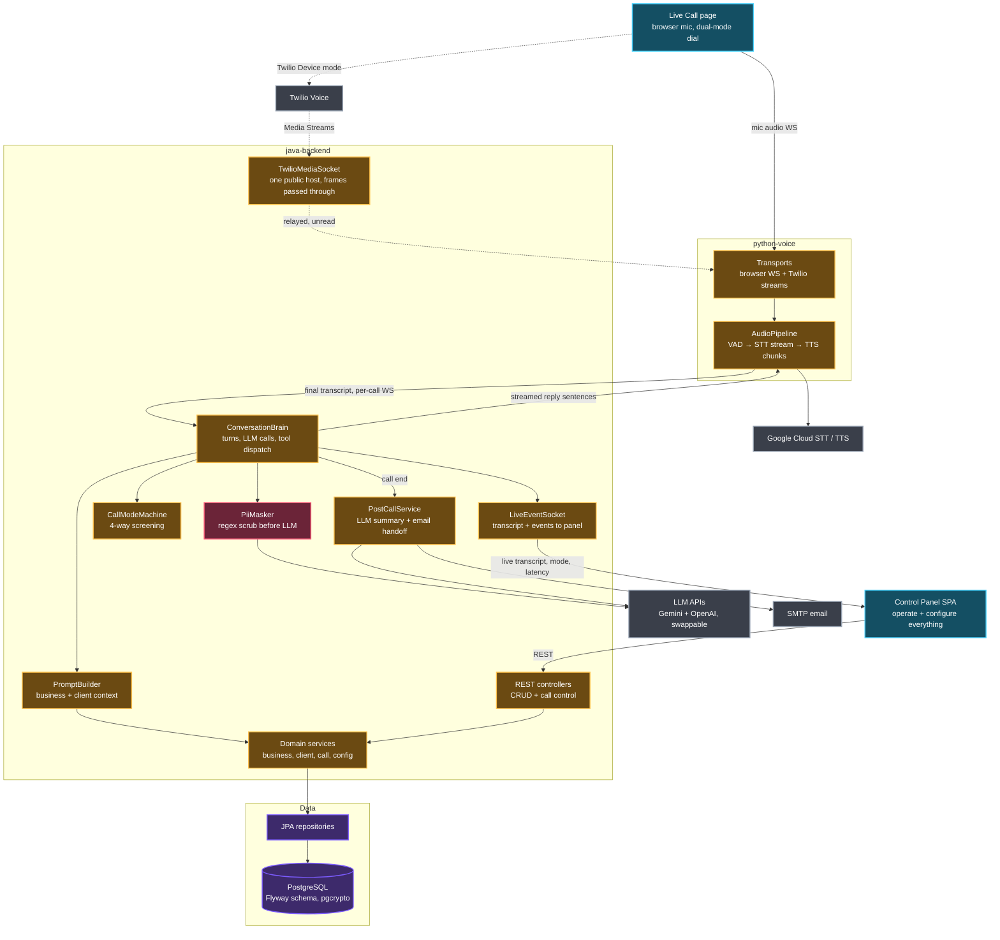

# Architecture — AI Customer Service Agent v2

Target architecture (approved scope). Regenerated at every phase close; nodes not yet built
are the plan, not the state — PROJECT_STATE.md says which phase is real.

**Built as of Phase 7 — everything below is real.** The Data layer (Postgres, Flyway, JPA
repositories), every domain service — businesses, config, knowledge, customers, call logging,
call history, summaries, email and metrics — the REST controllers over all of them, both call
transports (browser microphone and Twilio Media Streams) with VAD, speech recognition and
synthesis behind them, the conversation itself (ConversationBrain, TurnRunner, PromptBuilder,
the swappable LLM layer, the per-call turn websocket), the screening over it (CallModeMachine,
seven tools, the bilingual greeting, InactivityWatchdog), what happens after it (PiiMasker,
PostCallService, MailService), two seeded businesses in different trades, and the whole panel:
Dashboard, Live Call, Businesses, the six-tab business editor, Clients, Call History and
Settings.

Nothing is left as plan. What is left is verification: `docs/ors/PROJECT_STATE.md` lists what
has run against a live stack and what still needs a credential, a microphone or Docker.



## How it fits together

You open the panel at `localhost:8080` and hit "Start browser call" on the Live Call page.
The browser captures your mic and streams PCM frames over a WebSocket to the Python voice
server (port 8090). VAD watches the stream; when you stop talking, the streaming STT result
is finalized and sent up the per-call WebSocket to the Java brain. The brain runs the mode
machine, builds a prompt from the active business's knowledge, clients and persona (all read
from Postgres), scrubs PII, and calls the configured LLM (Gemini or OpenAI — LlmRouter
decides from Settings) with the tool schema. Reply text streams back
sentence by sentence; Python converts each sentence to TTS audio and plays it into the call
while the mic stays gated. Every line, mode switch and timestamp is echoed to the panel over
LiveEventSocket, so the transcript scrolls live with latency badges per turn.

In Twilio mode the front half changes and nothing else does: the Live Call page uses the
Twilio Device SDK, Twilio dials in, and its Media Streams WebSocket lands on the same
transport layer — by way of the backend, which serves `/ws/twilio` itself and relays the
frames on, so a telephone call needs one public address rather than two.

When the call ends — hangup, spam termination, or inactivity — the brain hands the finished
transcript to PostCallService, which asks Gemini for a structured summary, emails the
escalation contact if the mode was complex-request, and writes call, messages, timestamps
and summary to Postgres. The history page reads them back.

## Who owns what

| Component | Owns |
|---|---|
| ConversationBrain | Turn lifecycle: transcript in → mode check → prompt → LLM → tool dispatch → reply out |
| LlmRouter + providers | Picking provider/model from config (business override → global); Gemini + OpenAI REST clients behind one interface |
| CallModeMachine | The four screening states, legal transitions, per-mode instructions |
| PromptBuilder | Assembling system prompt from business KB, client record, persona, hours |
| Domain services | CRUD + validation for businesses, KB entries, clients, calls, config |
| PostCallService | Summaries, escalation email, final persistence |
| PiiMasker | Regex scrub of NIDs, balances, etc. before anything leaves for Gemini |
| AudioPipeline (py) | VAD, STT streaming, TTS synthesis, provider fallback, mic gating |
| Transports (py) | Browser WS framing + Twilio Media Streams framing → one internal format |
| LiveEventSocket | Fan-out of transcript/mode/latency events to the panel |
| Panel SPA | All operator screens, styled solely from STYLE-CONTRACT.md tokens |

## What exists after Phase 1

```
docker compose up
  ├── postgres:16-alpine ── volume pgdata
  └── java-backend  ── Flyway V1 (schema) + V2 (Template Business, 27 config keys)
                    ── serves the panel and the REST API on :8080
```

| Layer | Built in Phase 1 |
|---|---|
| `domain/` | 10 entities, 5 enums — the whole target schema, not just what Phase 1 reads |
| `repo/` | one Spring Data interface per entity |
| `services/` | BusinessService (list, CRUD, activate), ConfigService (typed reads, placeholder detection, secret masking), LegacyImportService (v1 JSON → DB, idempotent) |
| `api/` | BusinessController, ConfigController, HealthController, ImportController, LangController, ApiExceptionAdvice, 5 dto records |
| `static/` | shell + Businesses (read-only) + Settings; four sections render an empty-state naming their phase |

Three rules set here that later phases inherit:

- **Placeholders never block boot.** Every credential is a `PLACEHOLDER_*` string in
  `app_config`. `ConfigService.isPlaceholder(key)` is how a feature decides to switch itself
  off politely. Nothing in the app may hard-require a credential to start.
- **Secrets are masked at the boundary.** `GET /api/config` returns `••••1234` for a secret,
  never the value. A secret submitted blank keeps what is stored, so an ordinary save cannot
  destroy a key.
- **The panel holds no words.** Every string comes from `utils/Lang.java` over
  `GET /api/lang?lang=en|bn`. A wording or translation change touches one Java file.

The JSON tree under `java-backend/data/` is now read-only history: it is imported once at
start-up and nothing else reads it.

## What Phase 2 added

```
docker compose up
  ├── postgres:16-alpine ── volume pgdata
  ├── java-backend  ── panel + REST + /ws/live          :8080
  └── python-voice  ── call audio, VAD, speech          :8090
```

One turn, end to end:

```
mic ─48k─▶ AudioWorklet ─16k PCM16─▶ ws /ws/browser/{callId} ─┬─▶ Endpointer ─600ms silence─┐
                                                              └─▶ SttStream ────final text──┤
   speakers ◀──── PCM16 chunks ◀──── TtsProvider ◀──── reply ◀─────────────────────────────┘
                                          │
                       POST /api/call/{id}/line ─▶ CallLogService ─┬─ call_message row
                                                                   └─ /ws/live ─▶ panel
```

| Layer | Built in Phase 2 |
|---|---|
| `python-voice/` | `server.py`, `session.py` (turn-taking, half-duplex gate, latency stamps), `config.py`, `audio.py`, `java_link.py`, `transports/browser_ws.py`, `pipeline/{vad, providers, stt_gcp, stt_fallback, tts_gcp, tts_fallback}.py`, `tests/` |
| `api/` | CallController (start / line / end), LiveEventSocket, WsConfig, CallDtos |
| `services/` | CallLogService — the transcript, its timings, and the live broadcast |
| `static/js/` | `ws.js`, `audio/{mic_stream, mic_worklet, player}.js`, `pages/live_call.js` |

Four rules set here that later phases inherit:

- **Audio never touches Java, text never touches the audio socket.** The microphone talks
  straight to the voice server; the transcript comes back through the backend, which is also
  what writes it down. Anything added between a caller and a recogniser is latency.
- **Providers pick themselves.** Google Cloud when a real credentials file exists, the free
  offline pair otherwise. Named-but-broken degrades to free with a warning; a call never
  fails to start over a missing key.
- **The agent finishes its sentence, and never hears itself.** Incoming audio is discarded
  while the agent speaks — on the server, not just in the page — and a caller talking over
  the agent does not cut it off.
- **Timings are per turn, not averaged.** `tSttFinal` and `tTtsFirst` are stored on every
  agent line, so a slow reply can be traced to a stage instead of guessed at. Phase 3 filled
  in `tLlmFirst` between them.

Internally the voice server speaks one audio format everywhere: 16 kHz, 16-bit, mono PCM.
Transports convert on the way in and out, so nothing downstream asks what shape the bytes are.

## What Phase 3 added

The conversation moved to Java. The voice server no longer decides anything a caller hears; it
carries audio, recognises speech, and speaks whatever the brain sends it.

```
                    ws /ws/turn/{callId}          one socket per call, text only
python-voice ─────────────────────────────────────────▶ java-backend
   transcript_final{text, tSttFinal}                       │
   spoken{seq, tTtsFirst}                                  ▼
   call_end{reason}                            ConversationBrain
                                                 ├─ CallSession    history, persona, knowledge
                                                 ├─ PromptBuilder  the business's own words
                                                 ├─ LlmRouter ──▶ Gemini | OpenAI  (streaming)
                                                 └─ SentenceSplitter
python-voice ◀─────────────────────────────────────────  say{seq, text, last}
   speaks each sentence as it lands                       greeting{text, language}
```

| Layer | Built in Phase 3 |
|---|---|
| `brain/llm/` | `LlmProvider` + `LlmRequest` + `LlmStreamHandler`, `GeminiProvider`, `OpenAiProvider`, `LlmRouter`, and `SseChat` — the transport, timeout and retry both vendors share |
| `brain/` | `ConversationBrain` (turn lifecycle), `CallSession`, `CallRegistry`, `PromptBuilder`, `SentenceSplitter` |
| `api/` | `TurnSocket` at `/ws/turn/{callId}`; `CallController` lost `/line` to it |
| `services/` | `KbService`; `CallLogService` now records caller and agent lines separately and completes a timing that arrives late |
| `python-voice/` | `java_link.py` rewritten as a reconnecting websocket client; `session.py` speaks a queue instead of composing a reply |
| tests | `SentenceSplitterTest`, `PromptBuilderTest`, `LlmRouterTest`; the Python turn tests rewritten around a stand-in brain |

Four rules set here that later phases inherit:

- **The model is a setting, not a dependency.** Everything above `LlmProvider` is written
  against one interface, and which vendor sits behind it is read fresh at the start of every
  call — from the business's own AI settings first, the Settings page second. Swapping them
  mid-session changes the next call.
- **Grounded or not at all.** The prompt carries the business's About text, services, policies,
  questions, contact details and opening hours, and the standing orders say to use nothing
  else. A day the owner left blank is written out as closed rather than omitted, because a gap
  is an invitation to guess.
- **Sentences leave as they finish.** The reply is streamed, split at sentence endings, and
  handed to the voice one at a time. Waiting for the whole answer would cost most of the
  two-second budget, which is why `last` marks the end of a turn instead of being inferred.
- **A missing key is an answer, not an error.** No key, no brain, no model reply — each has a
  sentence the agent says out loud, in both languages, from `Lang.java`. Nothing in this layer
  may leave a caller listening to silence.

The three latency stamps now meet on one row. Python owns `tSttFinal` and `tTtsFirst`, Java
owns `tLlmFirst`, and because Java is what writes the row the voice server reports its second
stamp back over the same socket. Whichever half arrives second completes the reading.

## What Phase 4 added

The call now decides what kind of call it is, and in which language.

```
                    NEW_CUSTOMER ──┬──▶ EXISTING_CUSTOMER ──┐
                                   │                        ├──▶ COMPLEX_REQUEST   (stays on the line)
                                   └────────────────────────┴──▶ WRONG_NUMBER      (goodbye, hangup)

one turn:  prompt + 3 tool schemas ──▶ model ──┬── text ──▶ sentences ──▶ say{…}
                                               └── tool calls ──▶ ToolExecutor
                                                                    ├─ set_language ─▶ say{…, language}
                                                                    ├─ set_mode ─────▶ CallModeMachine
                                                                    └─ end_call ─────▶ hangup{reason, farewell}
                                                        │
                          second pass, NO tools offered ─┘   so it has to answer in words
```

| Layer | Built in Phase 4 |
|---|---|
| `brain/` | `CallModeMachine` (legality table, per-mode standing orders, who hangs up), `TurnRunner` (one turn, split out of the brain), `InactivityWatchdog` |
| `brain/tools/` | `ToolRegistry` — three schemas in a shape both vendors read; `ToolExecutor` — carries them out and answers in JSON, including its refusals |
| `api/` | `POST /api/call/{id}/mode`, the operator's override |
| `services/` | `CallLogService` writes mode transitions and language changes and pushes both to the panel |
| `python-voice/` | a second language on the recogniser, a voice per sentence rather than per call, and reporting an utterance nobody could make out |
| `static/js/` | `live_transcript.js` (the transcript view, lifted out), the screening facts, the override dropdown, mode and language notes in the transcript |

Four rules set here that later phases inherit:

- **One table, one answer, whoever is asking.** The model and the operator go through the same
  legality check. A call that has already said goodbye does not get talked back into being a
  customer, from the phone or from the panel.
- **What the model can do, it does through a tool.** Version 1 had it write `[MODE:…]` at the
  end of a reply and stripped the tag out before speaking; that works until the day it does
  not strip cleanly and a caller hears it. A function call cannot be spoken by accident.
- **A turn goes around at most twice.** The pass after a tool call is offered no tools, so the
  only thing the model can do with it is talk to the caller. That is the loop guard — not a
  counter, an absence.
- **The agent says the language question in both languages, in both voices.** It is the one
  moment nobody knows which is wanted. Each half is its own `say`, tagged with its own
  language, and the whole greeting is one turn, so the microphone opens once at the end of it.

Silence is measured in Java, not in the audio path. The voice server knows about frames; only
the brain knows whether a call is quiet because nobody is talking or because a model is
thinking, so a call mid-turn is skipped by the sweep.

## What Phase 5 added

The agent learned who it is talking to, and everything it reads became editable in the browser.

```
   panel                          java-backend                        postgres
 ┌────────────┐   REST      ┌──────────────────────┐
 │ Businesses │────────────▶│ BusinessService      │──▶ business, ai_settings, escalation_contact
 │ + editor   │             │ KbService            │──▶ kb_entry   (order = prompt order)
 │ Clients    │             │ ClientService ───────┼──▶ client     phone_enc / email_enc
 └────────────┘             └──────────┬───────────┘        ▲  pgp_sym_encrypt on the way in
                                       │                    │  try_decrypt   on the way out
 a call, mid-conversation              ▼
   lookup_client  ─┐         ┌──────────────────┐
   create_client  ─┼────────▶│  ToolExecutor    │──▶ CallSession.client ──▶ PromptBuilder
   log_request    ─┘         └──────────────────┘         │
                                                          └──▶ call_record.client_id + /ws/live
```

| Layer | Built in Phase 5 |
|---|---|
| `services/` | `ClientService` — the one class that reads and writes the encrypted columns; `KbService` and `BusinessService` grew the rest of the editing |
| `api/` | `ClientController`, `KbController`, `AiSettingsController`, `ClientDtos`, `EditorDtos` |
| `brain/tools/` | `lookup_client`, `create_client`, `log_request` — six tools now |
| `db/migration/` | `V3__try_decrypt.sql`, one function so a changed PII key costs contacts rather than the page |
| `static/js/` | `business_editor.js`, `clients.js`, read/write `businesses.js`, and the dialog / confirm / tab-strip / form parts in `components.js` |
| `utils/` | `Prompts.java` — the model's standing orders, moved out of `Lang` |
| deleted | `ConsoleTerminal`, `Console`, and nineteen console-only strings |

Four rules set here that later phases inherit:

- **One class knows how to open the box.** Contact details are pgcrypto blobs in the database
  and plain strings everywhere above `ClientService`. That means those rows are read and
  written in SQL rather than through JPA, and it means nothing else in the app has to know.
- **A key that no longer fits costs contacts, not the page.** `try_decrypt` turns an
  undecryptable row into nulls instead of an exception that aborts the transaction. The record
  still shows its name, notes and history, and the panel says plainly why the rest is missing.
- **Nothing a call reads is copied anywhere.** The prompt is assembled from these rows at the
  moment the call is placed. There is no cache to invalidate and no restart to remember, which
  is what makes the editor worth having.
- **The order of the knowledge base is editorial.** Entries reach the prompt in the order their
  owner put them in, so moving one up is a button of its own rather than a field on a form.

Writing a customer down does not make them a known customer *on that call*: they were a
stranger when they rang, and the transcript should say so. Only `lookup_client` promotes a call
to EXISTING_CUSTOMER.

## What Phase 6 added

A call is no longer over when the caller hangs up.

```
 caller says                                    what is kept                what is sent
 "my NID is 1990123456789"
        │
        ├──▶ call_message.text ──────────────▶ the real words          (panel, history, download)
        │
        └──▶ PiiMasker.mask ──▶ "[MASKED_NID]" ──▶ CallSession history ──▶ the model
                                                └──▶ PostCallService ──┬──▶ summary
                                                                       └──▶ escalation email

 hangup ──▶ CallLogService.end ──true, once──▶ PostCallService  (own thread; nobody is waiting)
                                                  ├─ LlmRouter ──▶ {summary_text, structured, action_items}
                                                  ├─ mode_path ◀── mode_transition rows, not the model
                                                  ├─ call_summary row              every call, always
                                                  └─ COMPLEX_REQUEST? ──▶ MailService ──▶ SMTP
                                                                                     └──▶ the log, in full,
                                                                                          when unconfigured
```

| Layer | Built in Phase 6 |
|---|---|
| `utils/` | `PiiMasker` — national IDs, phones, emails and amounts, in both scripts; `LangPages`, the per-page half of the catalogue after it outgrew one file |
| `services/` | `PostCallService` (the write-up and the handoff), `MailService` (SMTP from settings, or the log), `CallHistoryService` (reading a finished call back), `MetricsService` (percentiles and the distribution) |
| `api/` | `CallHistoryController` — `GET /api/calls`, `/api/calls/{id}`, `/api/calls/{id}/export`; the history shapes in `CallDtos` |
| `brain/tools/` | `escalate_to_human` — seven tools now |
| `static/js/` | `history.js` (the list and one call in full), the finished `dashboard.js`, and the contract's `progress` part in `parts.css` |

Four rules set here that Phase 7 inherits:

- **Masking is about what leaves the building.** The transcript keeps what was said, because
  the operator watching a call is supervising it. The model, the summary and the email get the
  masked copy. A number the masker cannot account for — an order number, a year, a date — is
  left alone, because a model that can see no numbers cannot answer the question it was asked.
- **The write-up reads the database, not a session.** Nothing is carried in memory between the
  hangup and the email. A call whose record says a person was promised is a call that gets one,
  whatever happened to the process in between.
- **Every call gets a summary, including the ones no model saw.** No key, no answer, unreadable
  JSON — each ends with a summary row saying so in the call's own language. That is what makes
  "written up" a column worth trusting.
- **What the app already knows, it does not ask the model.** `mode_path` is assembled from the
  call's own transitions. Asking for it would be inviting a guess about a fact on file.

Reading a call back is a different job from writing it down, and they are different classes:
`CallLogService` writes and broadcasts while the call is live; `CallHistoryService` only reads,
and has no live feed at all.

## What Phase 7 added

A call can arrive over a telephone, and a second business proves that onboarding is
configuration.

```
 browser tab ──PCM16 16k──────────────────────────┐
                                                  ├──▶ VoiceSession ──▶ the same brain
 a telephone ──Twilio──▶ /ws/twilio ──mu-law 8k───┘      (telephony="browser"|"twilio")
                            │  base64 in JSON, converted at this edge and nowhere else
                            │
   panel ──▶ /api/twilio/token ──▶ JWT signed with the API key secret (no SDK)
   Twilio ─▶ /api/twilio/voice ──▶ <Connect><Stream url="wss://…/ws/twilio">
                                     <Parameter name="callId"/>       ← ties audio to a record
                                   or, unconfigured, <Say>…</Say><Hangup/>   never an HTTP error
```

| Layer | Built in Phase 7 |
|---|---|
| `api/` | `TwilioController` — the access token, minted by hand, and the TwiML that points Twilio's media stream at the voice server |
| `python-voice/` | `transports/twilio_ws.py` — the Media Streams event protocol and the mu-law edge; `server.py` counts calls from both transports |
| `static/js/` | `twilio_mode.js` — the SDK lazy-loaded from a pinned CDN URL, the device, and the tooltip when there is nothing to press |
| `db/migration/` | `V4__seed_demo_two.sql` (Demo Courier), `V5` and `V6` correcting the model a clean install starts on |
| fixes | `ClientService.sameNumber` (a masked number matched the first customer on the books), `SseChat` retrying a transient refusal, `CallLogService` recognising an inbound number |

Three rules set here:

- **The transport is the only thing that knows about telephones.** Audio is converted to
  16 kHz PCM16 at the edge of `twilio_ws.py`, and nothing past it — session, brain, tools,
  transcript — can tell which way the call arrived. That is what makes "the same brain" true
  rather than aspirational.
- **A caller on the line is never shown an error.** The TwiML endpoint answers 200 with a
  spoken apology when the system is unconfigured, because an HTTP error would make Twilio play
  its own recording to a stranger.
- **A number with no digits matches nobody.** Masking sends `[MASKED_PHONE]` to the model, the
  model passes it back into `lookup_client`, and a matching rule built on `endsWith` treated
  that as matching everyone. Six digits minimum, on both sides.

The model is now chosen by measurement: `gemini-3.1-flash-lite` answers in a median 800 ms
against `gemini-3.6-flash`'s 3823 ms, and the whole turn budget is 2000 ms.

## What the security and defect passes changed

Not a phase — two passes over `SECURITY-AUDIT.md`, the first closing the 🔴/🟠/🟡 findings and
the second the 🔵 Low ones, the bugs and the warnings. The shape of the system is unchanged;
what changed is what stands in front of it and what the database holds.

```
        anything at all ──▶ SecurityFilterChain ──▶ one operator, HTTP Basic, BCrypt
                                   │
                                   ├── /api/twilio/voice   ← signature instead of a login
                                   └── /api/health/live    ← a bare "the process is up"

  browser ──▶ /ws/browser/{uuid} ──▶ guard.py: is it a UUID? is the Origin ours?
  Twilio  ──▶ /ws/twilio         ──▶ the same, plus the callId the webhook opened
```

| Layer | Added or changed |
|---|---|
| `api/` | `SecurityConfig` — the login, and the CSP / frame / referrer / permissions headers with it. Session cookie is `SameSite=strict`, which is what stands in for the CSRF tokens the panel's websockets cannot carry |
| `db/migration/` | `V7` — `smtp_auth` and `log_unsent_email_body`, two settings that were being inferred. `V8` — `client.phone_hash`, an indexed SHA-256 of the last nine digits, so finding an inbound caller is a lookup rather than a decryption per customer |
| `services/` | `ClientService` scopes every read and write by business id and takes its key through the constructor; `CallLogService` locks the call row before choosing a line number; `PostCallService` drains on shutdown and holds four write-ups at a time; `MailService` requires STARTTLS and checks the certificate |
| `utils/` | `PiiMasker` also masks cards, long account numbers and IBANs; `FileUtils.logError` writes through SLF4J instead of opening files of its own |
| `python-voice/` | `transports/guard.py`; `session.py` keeps a strong reference to every background task and counts sentences to end a turn; `stt_gcp.py` retries the second language after ten minutes instead of never |
| around the code | `logback-spring.xml` (rolling, capped), `.githooks/pre-commit` (gitleaks), `.github/workflows/dependency-scan.yml` (OWASP + pip-audit), a `.dockerignore` per build context, both images running as uid 10001 |

Two rules set here:

- **A number is a hint, never proof.** Caller ID does not bind a call to a customer record;
  the agent has to confirm who it is speaking to, and three wrong answers lock the call.
- **Nothing stored is an instruction.** Text that came from a caller — past issues, notes — is
  fenced as `<caller_record trust="data-only">` in the prompt, with chat-role prefixes and
  angle brackets neutralised on the way in.

## What the turn-taking pass changed

Not a phase either — nine faults from Nanjiba's own calls, and seven of the nine turn out to
be one question asked in different places: **who has the floor, and how does anything else
know?** The agent's audio finishes playing several seconds after it is sent, and the free
recogniser says nothing at all until a caller's sentence is finished, so both ends of a
conversation were invisible to the part deciding whether to speak.

```
  agent speaks ──▶ samples sent in ms ──▶ buffer ──▶ heard over several seconds
                        │                                      │
                        │                        page: {"audio_done"} ─┐
                        └── estimate from sample length ───────────────┤
                                                                       ▼
                                              wait for the later of the two, + 400 ms
                                                                       │
                        ┌──────────────────────────────────────────────┘
                        ▼
        mic reopens ──▶ VAD: speech_start ──▶ caller_speaking ─┐
                                  │                            ├──▶ nobody interrupts
                        utterance ─┴─▶ caller_stopped ──────────┘
```

| Layer | Added or changed |
|---|---|
| `brain/` | `CallInterventions` — everything the agent says that no caller asked for, and the one way a call hangs up, split out of `ConversationBrain`; `Greeter` — the opening, split out for the same reason; `LanguageSense` — which language the caller is actually speaking, read from the script their words came back in |
| `brain/` | `CallSession` gains a floor: `agentHasTheFloor` (set by `send` itself, so no call site can forget), `callerIsSpeaking` with a 60-second backstop, and a slang strike count. `InactivityWatchdog` now depends on `CallInterventions` rather than the whole brain, and stays quiet while either party holds the floor |
| `utils/` | `SlangGuard` — a short list of words with no other meaning, matched whole; `Prompts` gains the always-ask-a-question rule, the nuisance-caller block and the exchange count that makes "a second time" checkable |
| `api/` | `TurnSocket` routes two new messages up: `caller_speaking`, `caller_stopped` |
| `python-voice/` | `session.py` waits for the later of the sample-length estimate and the transport's own `audio_done`, then 400 ms more; `browser_ws.py` carries that report; `tts_windows.py` speaks with the OneCore voices SAPI refuses to enumerate; `voices.py` keys its cache on the credentials file and lists what Windows installed elsewhere; `stt_fallback.py` retries an utterance in the other language |
| `static/js/` | `call_stats.js` (the two formatted numbers, out of `live_call.js`); the page reports playback finishing; Settings names the voice behind "whichever the provider picks" and says when a key file is one character from where it should be |

Three rules set here:

- **An estimate is a lower bound, not an end.** Anything that waits for the agent to stop
  waits for the transport to say so, and then a little longer. Ending on the estimate cut off
  farewells and let the agent hear its own tail as a caller who could not be understood.
- **Every loop ends.** A re-prompt is the agent speaking, which restarts the silence clock, so
  a counter that resets when it re-prompts can never reach anything. Two asks, then goodbye.
- **The model is asked, not relied on, for what can be measured.** Which language a caller is
  speaking is written in their words; the agent follows that whether or not the model notices.

## What the live-call pass changed

Four faults from one four-minute call, and two of them are the same question the turn-taking
pass asked: **when is the call over, and who is the caller?** Both had been answered for one
path each and left unanswered for the other.

```
  ends the call ─┬─ operator presses End call ─▶ clock stops, mic released ✓
                 └─ the agent hangs up ────────▶ the words changed, nothing else did ✗
                                                 → both go through one teardown now

  who is calling ─┬─ the number matches ───────▶ "Recognised: Sadman" ✗  a number is not a person
                  └─ a record just written ────▶ "Recognised: Sadman" ✗  nothing was recognised
                                                 → name + number, and the note says which
```

| Layer | Added or changed |
|---|---|
| `brain/` | `FarewellSense` — whether a reply was the goodbye, read from the reply rather than from whether the model remembered to ask. `ConversationBrain.finishTurn` ends the call on one |
| `brain/tools/` | `escalate_to_human` refuses an escalation that cannot say what the matter is; `lookup_client` requires the name beside the number; `create_client` refuses a number already on the books |
| `services/` | `ClientService.sameName` — part of a name matching the whole of it; `CallLogService.recordClient` carries whether the caller was matched or written down |
| `utils/` | `Prompts.ASKING_FOR_A_PERSON` — ask what it is about, try to answer it, then hand it over |
| `static/js/` | `live_call.js` releases the call the same way whoever ended it; `live_facts.js` is the facts grid, split out at the 500-line cap |

Two rules set here:

- **What the model said is better evidence than what it asked for.** A model writing a
  farewell is exactly the model that stops calling tools, so the goodbye is read out of the
  words. The standing orders make that readable: every reply but the last ends with a question.
- **Two facts that agree, or nobody.** A number identified a caller on its own, and numbers are
  shared, reassigned and misheard. Names are not unique either — that is the point — so
  identity needs both, and a record written during the call is not an identification at all.

## What the setup-file pass changed

A business can be downloaded and uploaded. Nothing about a call changed; what changed is that
the afternoon of typing behind one is now portable.

```
  Businesses ──▶ GET /api/businesses/{id}/export ──▶ business-<handle>.json
                                                       │  business · persona
                                                       │  knowledge[] · escalationContacts[]
                                                       ▼
                 POST /api/businesses/import  ◀── add ─┤ a new business, its own handle
                          │                            └ replace ─▶ an existing one, emptied first
                          ▼
        BusinessService + KbService — the same two the editor's own forms post to
```

| Layer | Added or changed |
|---|---|
| `api/dto/` | `TransferDtos` — one record used in both directions, so an export shape and an import shape cannot drift apart |
| `services/` | `BusinessTransferService` — a coordinator that validates nothing itself; the two repositories it does touch directly are for the bulk deletes a replace needs |
| `repo/` | `KbEntryRepository` and `EscalationContactRepository` gain a JPQL bulk delete — a derived delete would be flushed *after* the inserts that follow it |
| `static/js/` | `pages/business_transfer.js` — the download anchor and the import dialog, out of `businesses.js` because the page owns the row and this owns the file |

Two rules set here:

- **A file cannot say anything the panel could not.** Every write goes through the services the
  editor posts to, so the import path adds no second way into the database and no second set of
  rules about what may be in it.
- **What travels is the business, not the installation.** Customers, call history, the handle
  and the active flag all stay behind: the first two because a knowledge base is not personal
  data, the last two because they are this machine's answers rather than the file's.

## What the one-tunnel fix changed

Not a phase either — one fault, and it is not in the code but in what the code assumed the
world would provide. A telephone call needs two things reachable from the internet: the
webhook, on the backend's 8080, and the media stream, which pointed at the voice server's
8090. A free ngrok account issues one hostname, so asking for two tunnels gets one, and half
of Twilio's traffic arrives at the wrong service.

```
  before                                   after
  Twilio ─┬─ tunnel A ─▶ 8080 /api/twilio/voice     Twilio ─┬─ one tunnel ─▶ 8080 /api/twilio/voice
          └─ tunnel B ─▶ 8090 /ws/twilio                    └──────────────▶ 8080 /ws/twilio
             ↑ a free plan has no tunnel B                                        │ relayed, unread
                                                            8090 /ws/twilio ◀──────┘  private network
```

| Layer | Added or changed |
|---|---|
| `api/` | `TwilioMediaSocket` — one outbound client socket per inbound call, text frames passed through in both directions, either end closing the other. `WsConfig` mounts it at `/ws/twilio`; `SecurityConfig` opens that path, because a handshake refused with 401 never reaches a handler |
| `python-voice/` | nothing. `transports/twilio_ws.py` cannot tell whether Twilio dialled it directly |

One rule set here:

- **A relay that understands the protocol is a second implementation of it.** This one reads
  nothing it carries and holds no call state, so there is no version of it that can fall
  behind the two real ends. What it does own is the pair: a half-open socket would leave
  Twilio pushing a whole call's audio into nothing, so whichever end goes first closes the
  other.

## What the report pass changed

The history page answers *what happened on that call*. Nothing answered *what has been
happening*, and that is the question anyone above the person who took the calls asks. It is
also the first thing this panel produces that is meant to leave it, which is what made a
print sheet unavoidable.

```
  Call history ──▶ Generate report ──▶ #/report/<from>/<to>/<business>
                                          │  the range is in the address,
                                          │  so a report is a link
                                          ▼
                     GET /api/calls/report?from=&to=&businessId=
                                          │
                     CallHistoryService.between ──▶ the same rows the history table shows
                                          │
                     CallReportService ───┴─▶ totals · outcomes · languages · days ·
                                              follow-ups · every call
                                          ▼
                              screen ──── Ctrl+P ────▶ print.css ──▶ ink on paper
```

| Layer | Added or changed |
|---|---|
| `api/` | `GET /api/calls/report` on `CallHistoryController`, mapped above `/{callId}` because "report" is a word and not an id — `CallReportRoutingTest` pins that. `ApiExceptionAdvice` answers 400 for a value that will not parse, where it used to answer 500 with a stack trace |
| `api/dto/` | `ReportDtos` — the report's own shapes, except a call, which is `CallDtos.CallListItem` |
| `services/` | `CallReportService`, all counting in pure statics so it is testable without a database; `CallHistoryService.between` and a shared `rows` builder |
| `utils/` | `ReplyTimes` — the latency arithmetic, moved out of `MetricsService` and `CallHistoryService` so the report and the dashboard cannot disagree. `LangReport`, a third catalogue file, because `LangPages` was at 444 of its 500 lines |
| `static/js/` | `pages/report.js` (the document), `pages/report_range.js` (the dialog), `statTile` promoted into `components.js` from the dashboard |
| `static/css/` | `print.css`, linked `media="print"`, and the paper tokens it reads in `nocturne.css` |
| `STYLE-CONTRACT.md` | `print-sheet` appended to section 4 — the contract's own escape valve, used for the first time |

Three rules set here:

- **A report may not disagree with the page it was made from.** Its rows are the history
  table's rows, its median is the dashboard's median, and its "nobody spoke" is the same rule
  `call_outcome.js` draws its badge from. Every one of those was a second implementation
  waiting to drift, and each is now one implementation read from two places.
- **Paper is not a light theme.** The contract refuses light mode because dark is the design,
  and that is a rule about screens. Browsers drop background colours when printing, so a
  Nocturne page on paper is light grey text on white — the choice was never dark against
  light, it was a readable document against an unreadable one. The escape valve exists for
  exactly this, so the sheet is a named part with its own values rather than a screen with an
  exception.
- **A document has no controls in it.** The range is chosen in a dialog and carried in the
  address, because a date picker on the page would be a date picker on the printout. For the
  same reason no row on the report can be clicked into: following a call up is what the
  history page is for, and a page that only works while the app is open is not a document.

## Panel screens in contract parts

Named in Nocturne vocabulary so screens are assembled, not invented: shell = `side-rail`
(Dashboard, Live Call, Businesses, Clients, Call History, Settings) + `top-bar` (active
business `dropdown`, health `status-bar`). Live Call = `panel` with primary/secondary/
destructive `button`s, transcript `scroll-region` of `list-row`s with `tag-badge`s (role,
timing, and a note row for each change of mode or language), `key-value` call facts including
which model is answering, who is calling and how the call is screened, `dropdown`s to dial as a
known customer and to overrule the screening, and a `toast` when it has no key to answer with
or refuses an override. Businesses = `table` + `dialog` forms + `destructive-confirm` deletes,
opening a `tab-strip` editor (About / Services / Policies / Questions / Persona / Hours &
handover) with `inline-error` validation and `toast` saves. Clients = `table` + `dialog` forms,
with a `tag-badge` where a contact detail cannot be decrypted. Settings = `key-value` forms.
Dashboard = `stat-tile` strip (one accented number, the median reply time) + capability
`list-row`s + a screening distribution of `list-row`s with `progress` bars in the data palette
+ recent-calls `table`. Call History = `table` of calls, and one call as `key-value` facts, a
summary `panel`, the screening steps as `list-row`s and the transcript as a `scroll-region` of
`list-row`s with role and timing `tag-badge`s. The report is asked for from a `dialog` off the
Call History table and drawn as `panel`s: a heading block, a `stat-tile` strip (one accented
number, the median reply again), three breakdowns of `list-row`s with `tag-badge`s and
`progress` bars, the follow-ups as `list-row`s, and every call as a `table` — then the whole
thing again as `print-sheet` when it is printed, which is the only part of the panel that is
not a screen. The Twilio dial is a secondary `button` beside the primary one, disabled with a
tooltip until its credentials are real — the contract's own answer for an action that exists
but cannot be taken yet.
