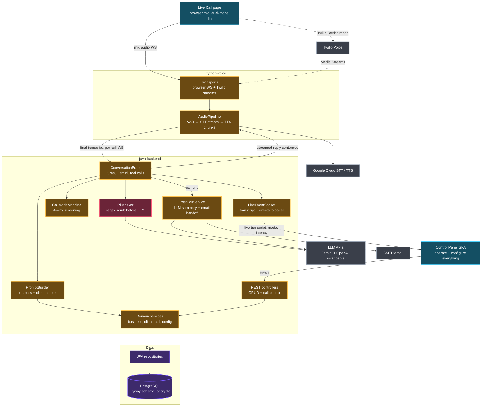

# Proposal — AI Customer Service Agent v2

**Platform:** Java 21 / Spring Boot 3.4 / Maven · Python 3.10+ / FastAPI · PostgreSQL 16 / Docker Compose · Vanilla-JS web panel (Nocturne aurora)
**Mode:** PHASED
**Ships as:** `docker compose up` stack (postgres + java-backend + python-voice) serving a web control panel at `localhost:8080`; Twilio mode optional via config

## What it does

A bilingual (English–Bangla) AI voice agent that answers customer-service calls for small businesses: it greets, screens callers into four categories (existing / new / spam / complex), answers from the business's own knowledge base, onboards new customers, escalates complex cases by email, and logs every call with an LLM-written summary. Calls are placed from a website — browser mic by default, Twilio when credentials exist. Everything a business needs (details, prompts, knowledge, clients, config) is editable live through the same website.

This evolves the existing repo: the Java brain skeleton (managers, models, REST API, CallMode) is kept and upgraded; the Python mic scripts are rewritten as a streaming voice server; the console UI is replaced by the web panel.

## Feature list

- **Web call tester** — dial from the browser (mic → WebSocket), live transcript, per-turn latency readout, mode/language badges, manual mode override for testing
- **Dual-mode telephony** — default browser-direct audio (zero external accounts); Twilio Voice JS SDK + Media Streams path activates when credentials are configured
- **Streaming voice pipeline (Python)** — VAD, Google Cloud streaming STT, Google Cloud TTS, half-duplex gating (no self-hearing), barge-in-safe; auto-fallback to v1's free STT + offline pyttsx3 when no GCP credentials
- **Conversation brain (Java)** — provider-agnostic LLM layer: Gemini **and** OpenAI implementations behind one `LlmProvider` interface, provider + model + API keys hot-swappable in Settings with per-business override; function calling (lookup/create client, log request, escalate, switch language, end call); dynamic prompt built per business from DB
- **Placeholder-first setup** — seeded Template Business, `.env.example`, placeholder Twilio routing, every credential a named `PLACEHOLDER_*` value editable in the panel post-build; `docs/SETUP.md` first-run guide
- **Four-way screening state machine** — existing customer, new customer onboarding, polite spam termination, complex-request handoff; mid-call detection via tool calls; inactivity handling
- **Bilingual** — language select at call start, mid-call switching, Bangla + English STT/TTS; Banglish fallback prompts
- **Full web control panel** — businesses CRUD, knowledge-base editor (about/services/policies/FAQs), AI persona & prompt editing, clients CRM, working hours & escalation contacts, global settings (API keys, TTS tuning) — everything you could edit in JSON, now in-app
- **Call logging & summaries** — full transcripts + LLM summary per call in Postgres, history browser, .txt export, one-time importer for the existing JSON data
- **Handoff & compliance** — email summary to escalation contact (SMTP), mandatory AI-disclosure greeting, regex PII masking before LLM calls, pgcrypto encryption on client contact columns
- **Metrics dashboard** — per-turn latency timestamps (STT-final → first TTS audio), classification counts for the 30-call evaluation, calls today

## Non-goals

Explicitly not building:

- **JavaFX desktop app** — web panel replaces both console and any desktop UI (your decision)
- **Real Bangladeshi phone numbers / PSTN** — proposal itself scopes telephony to simulation
- **Login / multi-user auth** — single operator on localhost; panel is not internet-facing
- **Live human barge-in / call transfer** — handoff is the email-summary simulation per the proposal
- **Custom Bangla ASR training or model fine-tuning** — commercial APIs only; WER documented as limitation
- **CRM integrations** — summaries are exportable, not pushed anywhere
- **Light mode** — Nocturne contract is dark-only

## Assumptions

Decisions made without asking. **Correct anything wrong here and it gets applied everywhere downstream.** Highest risk first.

| # | Assumption | Based on | Cost if wrong |
|---|---|---|---|
| 1 | **LLM is swappable**: `LlmProvider` interface, Gemini + OpenAI via REST (no SDKs), normalized internal tool-call schema; default `gemini` / flash-tier model, both keys as placeholders | Your APPROVE WITH CHANGES — keys bought for both | Low — that's the point of the interface |
| 2 | **Custom asyncio pipeline**, not the Pipecat framework — "Pipecat-style" streaming (VAD → STT stream → turn WS → TTS chunks) | Existing code has no Pipecat; custom is smaller, debuggable, and Claude-Code-buildable; browser transport would be custom in Pipecat anyway | Medium — rewrite Python transport layer |
| 3 | Python ↔ Java talk over a **per-call WebSocket** (transcripts up, streamed reply sentences down) instead of v1's one-shot HTTP, to hit <2 s | Latency objective in proposal | Medium — protocol rework |
| 4 | Web panel is a **vanilla-JS SPA** served from Spring Boot static resources, styled from STYLE-CONTRACT.md tokens — no Node/React toolchain | Keeps build = `mvn` only; report_dashboard.html precedent | Medium — redo in React if you want one |
| 5 | Voice providers are **pluggable with auto-fallback**: GCP STT/TTS primary; v1's free STT + pyttsx3 when creds absent (demo-safe, like dual-mode telephony) | v1 works this way today | Low-medium |
| 6 | Twilio mode needs a **public URL for Media Streams** — ngrok documented as the demo path | Twilio requirement | Low — Twilio mode is optional |
| 7 | Schema: businesses, ai_settings, kb_entries, clients (+ past_issues JSONB), calls, call_messages (with latency timestamps), call_summaries, escalation_contacts, app_config; Flyway migrations; ER diagram delivered with spec | Proposal deliverables + v1 JSON shapes | Low-medium |
| 8 | Keep `com.ulab.agent` package and Maven; bump Boot 3.2.4 → 3.4.x; Gson stays; rename `python-scripts/` → `python-voice/` | Existing repo | Low |
| 9 | Bangla TTS = Google `bn-IN` voices (closest available); quality logged as known limitation | GCP voice catalog | Low |
| 10 | Escalation email via Spring Mail SMTP (e.g. Gmail app password), configured in panel Settings | Proposal's "email summary" | Low |
| 11 | A root `CLAUDE.md` pointer (read PROJECT_STATE.md → BUILD_SPEC.md → current phase) is added for Claude Code automation | Your stated goal | None |

## Proposed structure

```
AI-Customer-Service-Agent/
├── CLAUDE.md                    Claude Code entry pointer
├── STYLE-CONTRACT.md            Nocturne aurora/comfortable/cyan (emitted, validated)
├── docker-compose.yml           postgres + java-backend + python-voice
├── .env.example                 every env var with a PLACEHOLDER_ value
├── docs/SETUP.md                first-run guide: keys, GCP creds, Twilio, SMTP, template business
├── docs/ors/                    proposal, BUILD_SPEC, phases, brief, architecture, PROJECT_STATE, logs/
├── java-backend/
│   └── src/main/java/com/ulab/agent/
│       ├── api/                 REST controllers + LiveEventSocket + TurnSocket
│       ├── brain/               ConversationBrain, CallModeMachine, PromptBuilder, tools
│       ├── brain/llm/           LlmProvider interface, GeminiProvider, OpenAiProvider, LlmRouter
│       ├── services/            Business/Client/Call/Config/PostCall services (evolved managers)
│       ├── domain/              JPA entities (evolved models)
│       ├── repo/                Spring Data repositories
│       └── utils/               Lang, PiiMasker, TimeUtils…
│   └── src/main/resources/
│       ├── static/              the web control panel (index.html, js/, css/nocturne.css)
│       └── db/migration/        Flyway V1__… .sql
└── python-voice/                (renamed from python-scripts)
    ├── server.py                FastAPI app, session manager
    ├── transports/              browser_ws.py, twilio_ws.py
    ├── pipeline/                vad.py, stt_gcp.py, tts_gcp.py, stt_fallback.py, tts_fallback.py
    └── java_link.py             per-call WS to the brain
```

## Architecture graph



## Phases

| # | Phase | Ships |
|---|---|---|
| 1 | Foundations — DB + panel shell | `docker compose up` starts Postgres + backend; Flyway schema; one-time JSON→DB import of existing data; Nocturne panel shell (side-rail, top-bar, status-bar) with read-only Businesses + Settings view |
| 2 | Voice loop v2 (echo, no AI) | Browser call from the Live Call page: speak → VAD → streaming STT → synthesized echo reply, <2 s; live transcript in panel; fallback providers work |
| 3 | Brain in the loop (English) | Real Gemini conversation grounded in the active business's DB knowledge; per-call WS Python↔Java; per-turn latency readout |
| 4 | Screening + bilingual | Language select at greeting, Bangla STT/TTS, mid-call language switch; all four modes visible incl. polite spam termination and inactivity hangup; AI-disclosure greeting |
| 5 | CRM + full editability | Existing-customer recognition, new-customer onboarding via tool calls; businesses/KB/persona/clients/hours/escalation fully editable in panel (your "full control" requirement) |
| 6 | Handoff, logging, metrics | Complex-request email escalation; post-call LLM summaries; call-history browser + export; PII masking; metrics dashboard (latency, classification counts) |
| 7 | Twilio mode + polish | Twilio Device calling end-to-end (token endpoint, TwiML, Media Streams via ngrok); second seeded business proving config-only onboarding; demo script + tuning |

## Dependencies

| Dependency | Version | Why |
|---|---|---|
| spring-boot-starter-parent (web, websocket, data-jpa, validation, mail) | 3.4.x | Existing stack, bumped; WS + JPA + mail needed now |
| org.postgresql:postgresql | 42.7.x | Postgres driver |
| flyway (core + postgresql) | Boot-managed 10.x | Versioned migrations — a graded deliverable |
| com.google.code.gson:gson | 2.10.1 | Already in repo; Gemini REST payloads |
| fastapi / uvicorn[standard] | 0.115.x / 0.32.x | Python WS audio server |
| google-cloud-speech / google-cloud-texttospeech | 2.x pinned at Phase 2 | Streaming STT + Bangla-capable TTS per proposal |
| webrtcvad | 2.0.10 | Voice activity detection, tiny and battle-tested |
| SpeechRecognition + pyttsx3 | 3.10.x / 2.90 | Fallback providers (already in v1) |
| Twilio Voice JS SDK (CDN) + twilio python | pinned at Phase 7 | Optional telephony mode |

Exact pins land in BUILD_SPEC.md; anything unverifiable today gets verified at its phase's install step.

## Risks and unknowns

- **<2 s latency with cloud round-trips** — mitigated by streaming STT, Gemini flash streaming, sentence-chunked TTS, and per-stage timestamps so the bottleneck is measurable, not guessed
- **Bangla WER / Banglish** — proposal itself expects this; fallback re-prompts + documented limitation
- **Echo/barge-in in browser mode** — browser echoCancellation + v1's half-duplex gate (mic muted while agent speaks)
- **GCP credentials/quota availability at demo time** — fallback providers keep every demo runnable
- **Twilio trial restrictions + ngrok dependency** — Twilio mode is optional by design; browser mode is the demo default

## Open questions

None — everything is decided above; correct any assumption at this gate.

---
**Reply APPROVE to proceed, APPROVE WITH CHANGES + your edits, or REVISE with what to change.**
